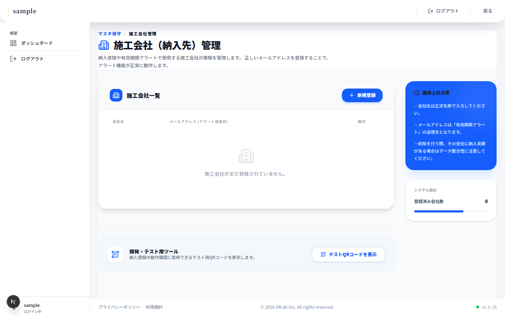
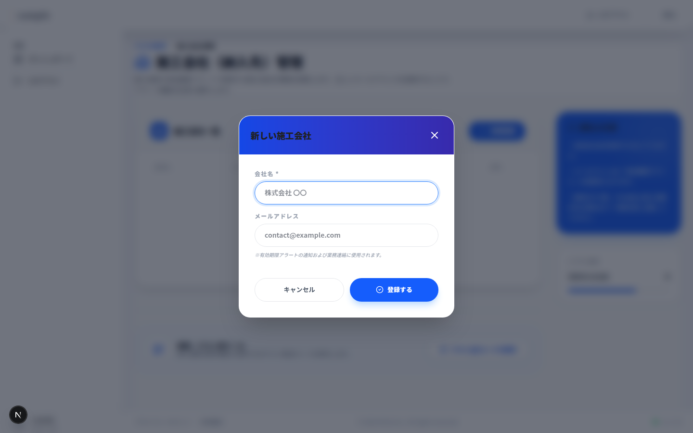
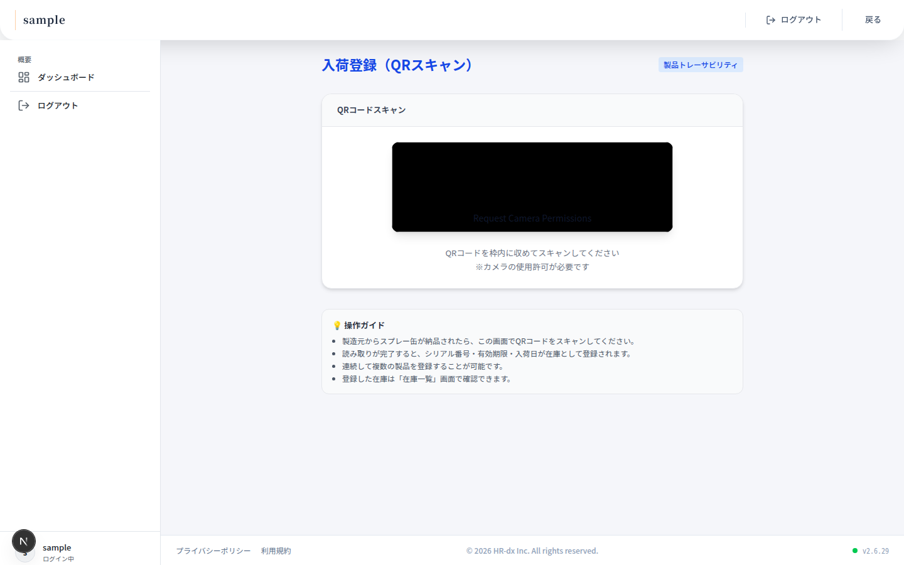
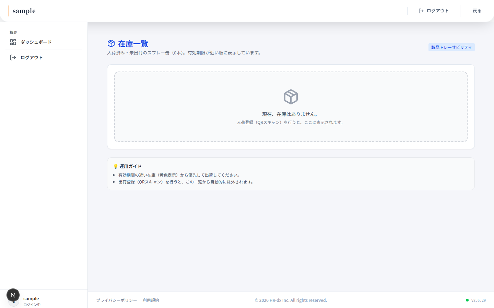
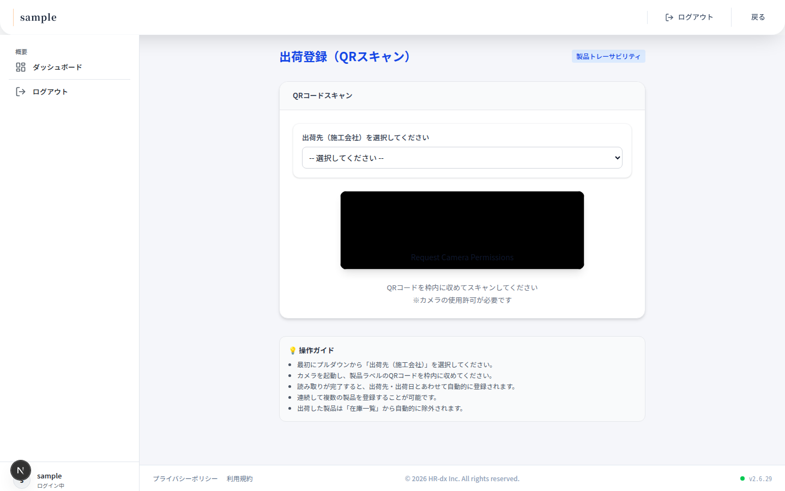
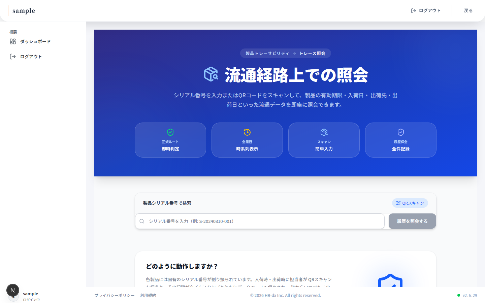
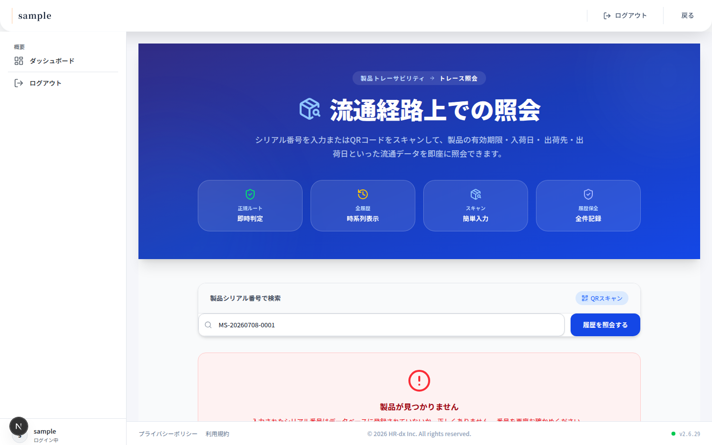
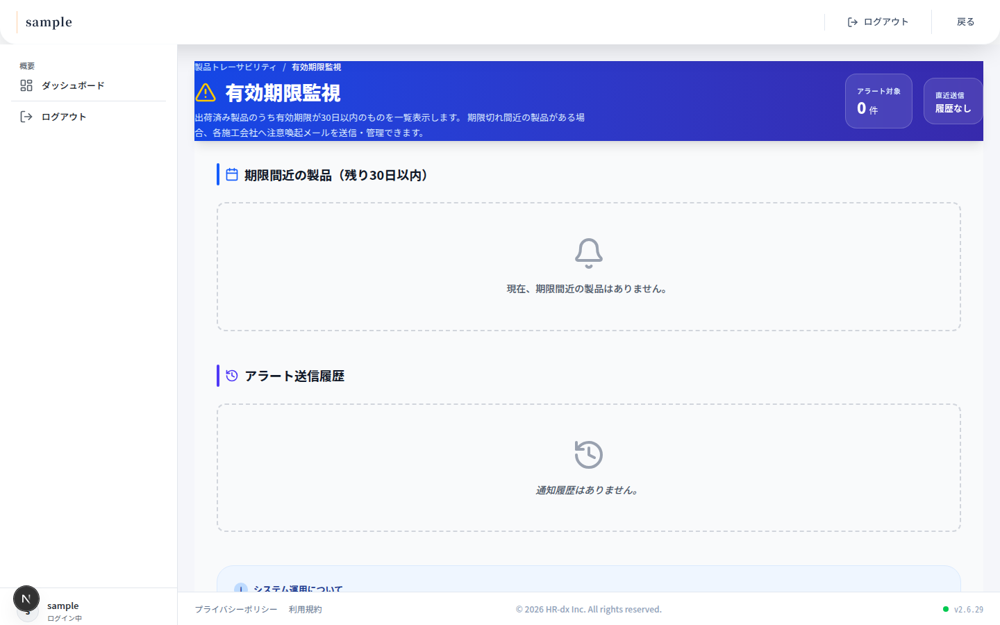

# システム仕様書

対象製品：**セルフィール MS**（スプレー缶）  
対象ユーザー：**（株）ミュー** の入荷・出荷・照会・アラート担当者  
利用システム：**HR-DX SaaS**（製品トレーサビリティ機能）

> 本マニュアルの画面キャプチャは HR-DX 開発環境（`localhost:3000`）で取得したものです。本番環境（`https://app.hr-dx.jp`）でもレイアウト・操作は同一です。

---

## 目次

1. [システム全体像](#1-システム全体像)
2. [システムの流れ](#2-システムの流れ)
3. [業務の流れに沿った操作手順](#3-業務の流れに沿った操作手順)

---

## 1. システム全体像

### 1.1 このシステムでできること

本システムは、スプレー缶製品「セルフィール MS」を **1本（1シリアル）単位** で管理し、流通履歴と有効期限をデジタルで記録・照会するためのものです。

| 機能             | 内容                                                                              |
| ---------------- | --------------------------------------------------------------------------------- |
| 入荷登録         | 製造元から納品された製品を QR スキャンで在庫登録（新規ロットは自動採番）          |
| 在庫一覧         | 未出荷の在庫を一覧表示（有効期限が近い順）                                        |
| 出荷登録         | 施工会社へ出荷する製品を QR スキャンで記録                                        |
| トレース照会     | シリアル番号または QR から流通履歴を検索                                          |
| 有効期限アラート | 出荷済み製品のうち期限が近いものを施工会社別に確認し、**手動で** 注意メールを送信 |

#### 導入効果

- **品質管理の強化** — 有効期限が近い製品を把握し、古い製品の使用を未然に防ぐ
- **トレーサビリティの確保** — 各製品が「いつ・どの施工会社へ」出荷されたかをシリアル単位で追跡でき、転売・不正利用の抑止に役立つ

> **注記（将来拡張）**  
> 提案仕様書には、有効期限アラートの **自動メール送信** および **購買管理・売掛管理とのデータ連携** も記載されています。現行バージョンではこれらは **未実装** です。アラートは担当者が画面から **手動送信** してください。

---

### 1.2 関係者と役割

| 関係者           | 役割                                     | システム利用                                           |
| ---------------- | ---------------------------------------- | ------------------------------------------------------ |
| 製造会社         | 製造、QRラベル貼付、（株）ミューへの納品 | 原則システム外（ラベルはミュー側で発行した QR を貼付） |
| **（株）ミュー** | 入荷・在庫・出荷・照会・アラート         | **本マニュアルの主対象**                               |
| 施工会社         | 発注・受領・現場使用                     | 直接操作なし（アラートメールの受信のみ）               |

---

### 1.3 画面一覧（HR-DX メニュー）

HR-DX にログイン後、サイドメニューから **「製品トレーサビリティ」** カテゴリを開き、各機能のカードボタンから画面へ移動します。

| メニュー名             | URL                       | 用途                               |
| ---------------------- | ------------------------- | ---------------------------------- |
| 入荷登録（QRスキャン） | `/myou/receiving-scan`    | 製造元納品の在庫登録               |
| 在庫一覧               | `/myou/inventory`         | 未出荷在庫の確認                   |
| 出荷登録（QRスキャン） | `/myou/delivery-scan`     | 施工会社への出荷登録               |
| トレーサビリティ検索   | `/myou/traceability`      | シリアル／QR で履歴照会            |
| 有効期限監視・アラート | `/myou/expiration-alerts` | 期限間近製品の確認・手動メール送信 |
| 納入先登録             | `/myou/companies`         | 施工会社マスタ（事前準備）         |

**ログイン方法**

1. HR-DX（本番: `https://app.hr-dx.jp`）にログイン
2. サイドメニューから「製品トレーサビリティ」を選択
3. 目的の機能カードをクリック

画面間の直接リンクはありません。別機能へ移る場合は、都度メニューから選択してください。


---

### 1.4 製品ステータス（システム内部の状態）

各スプレー缶（ロット）は、システム上で次の2つの状態を持ちます。

| ステータス     | 画面表示    | 意味                 |
| -------------- | ----------- | -------------------- |
| 在庫（入荷済） | `in_stock`  | 入荷登録済み・未出荷 |
| 出荷済         | `delivered` | 施工会社へ出荷済み   |

**状態の遷移**

```
在庫（入荷済） → 出荷済
```

- 入荷登録で新規ロットが「在庫」として登録されます
- 出荷登録で「在庫」→「出荷済」に変わります
- 返品などで「出荷済」→「在庫」に戻す再入荷も、警告付きで受け付けます

---

### 1.5 QRコード・ラベルの内容

#### QRコードのデータ形式

```
SERIAL:<シリアル番号>,EXP:<YYYY-MM-DD>
```

**例**

```
SERIAL:MS-20260708-0001,EXP:2026-12-31
```

#### シリアル番号の採番規則

```
MS-YYYYMMDD-NNNN
```

- `MS` … 製品識別子
- `YYYYMMDD` … 発行日（例: 20260708）
- `NNNN` … 当日の連番（0001 から）

#### ラベルに印字される項目（作業手順より）

| 項目         | 内容                             |
| ------------ | -------------------------------- |
| 製品名       | セルフィール MS                  |
| 取扱注意     | 高温・直射日光を避けて保管       |
| 有効期間     | 入荷登録時に指定した日付         |
| シリアル番号 | 上記採番規則に従った番号         |
| QRコード     | シリアル番号・有効期限を埋め込み |

---

## 2. システムの流れ

### 2.1 業務全体フロー

#### A. 製造 → 納品 → 在庫

1. 製造会社が、製品「セルフィール MS」を製造する
2. 製造会社（または物流）が、製品を（株）ミューへ納品する
3. （株）ミューが **入荷登録（QRスキャン）** 画面で登録する（新規ロットは自動採番。既存ロットへの追加納品はQRスキャンで数量加算）

```
製造 → ミューへ納品 → 入荷登録 → 在庫登録
```

#### B. 受注 → 出荷

1. 施工会社より（株）ミューへ受注（発注）がある
2. **在庫一覧** で在庫を確認し、引当てる（期限が近い在庫を優先）
3. **出荷登録（QRスキャン）** でロットのQRを読み取り、出荷先・数量を記録する

```
受注 → 在庫引当 → 出荷QRスキャン → 出荷記録
```

**運用上のポイント**

- 受注後は **在庫確認 → 出荷スキャン** のみで完結します。

---

### 2.2 システム上のデータの流れ

作業手順で定義された4つの処理ブロックと、対応する画面・保存データは次のとおりです。

| 作業                        | 保存される主な情報                           | 対応画面               |
| --------------------------- | -------------------------------------------- | ---------------------- |
| ミューへ納品 → QRスキャン   | シリアル番号、有効期限、入荷日（仕入納入日） | 入荷登録（QRスキャン） |
| ミューから出荷 → QRスキャン | 出荷先（施工会社）、出荷日、担当者           | 出荷登録（QRスキャン） |
| 問い合わせ                  | 出荷先、有効期限、仕入納入日、出荷日         | トレーサビリティ検索   |
| 期限監視                    | 施工会社別の期限間近製品リスト               | 有効期限監視・アラート |

---

### 2.3 事前準備

出荷登録および有効期限アラートを行う前に、**施工会社（納入先）のマスタ登録** が必要です。

| 登録項目       | 必須 | 用途                     |
| -------------- | ---- | ------------------------ |
| 会社名         | ○    | 出荷先プルダウンの表示   |
| メールアドレス | —    | 有効期限アラートの送信先 |

**納入先登録**（`/myou/companies`）画面で登録してください。詳細は [3.0 事前準備](#30-事前準備-施工会社の登録) を参照。

---

## 3. 業務の流れに沿った操作手順

日常業務では、次の順序で操作することを推奨します。

```
事前準備（施工会社登録）
  ↓
入荷登録 → 在庫確認
  ↓
出荷登録
  ↓
トレース照会 / 有効期限アラート（必要に応じて）
```

---

### 3.0 事前準備: 施工会社の登録

**画面:** 納入先登録（`/myou/companies`）

#### 操作手順

1. メニューから **「納入先登録」** を開く
2. **「新規登録」** ボタンをクリック
3. モーダルで以下を入力
   - **会社名**（必須）… 例: 株式会社 ○○
   - **メールアドレス**（任意）… アラート送信先。未設定の場合、アラート送信ボタンは使用不可
4. **「登録する」** をクリック

#### 成功メッセージ

| 操作     | メッセージ                 |
| -------- | -------------------------- |
| 新規登録 | `新規登録が完了しました。` |
| 更新     | `更新が完了しました。`     |
| 削除     | `削除が完了しました。`     |

#### 編集・削除

- 一覧の **鉛筆アイコン** … 編集
- 一覧の **ゴミ箱アイコン** … 削除（確認ダイアログあり）

#### 注意事項

- 出荷履歴から参照されている施工会社は **削除できません**
- 削除すると、その会社へのアラート送信履歴も **同時に削除** されます





---

### 3.1 入荷登録（製造元からの納品）

**画面:** 入荷登録（QRスキャン）（`/myou/receiving-scan`）

製造会社から納品されたスプレー缶の QR をスキャンし、（株）ミューの在庫として登録します。

#### 操作手順

1. メニューから **「入荷登録（QRスキャン）」** を開く
2. ブラウザの **カメラ使用許可** を与える
3. 製品ラベルの QR コードを **枠内に収めてスキャン**
4. 成功メッセージを確認
5. 複数本ある場合は、**連続してスキャン** 可能
6. **在庫一覧** 画面で登録内容を確認

#### 成功・警告・エラーメッセージ

| 種別         | メッセージ                                                      | 意味                     |
| ------------ | --------------------------------------------------------------- | ------------------------ |
| 成功（緑）   | `入荷登録成功: {シリアル}`                                      | 正常に在庫登録された     |
| 警告（黄）   | `{シリアル} は既に入荷済みです（情報を更新しました）。`         | 重複スキャン（情報更新） |
| 警告（黄）   | `{シリアル} は出荷済みでしたが、再入荷として在庫に戻しました。` | 返品などの再入荷         |
| エラー（赤） | `認証エラー` / `入荷情報の登録に失敗しました。` 等              | 再試行または管理者へ連絡 |

成功時は「直前のスキャン内容」としてシリアル・有効期限も表示されます。



---

### 3.2 在庫確認・引当

**画面:** 在庫一覧（`/myou/inventory`）

未出荷（在庫）のスプレー缶を一覧で確認し、出荷対象を選びます。

#### 操作手順

1. メニューから **「在庫一覧」** を開く
2. 一覧を確認（有効期限が近い順に表示）
3. 必要に応じて **検索バー** でシリアル番号を検索
4. 列ヘッダーをクリックして **ソート**（シリアル番号・有効期限・入荷日）
5. **期限状況が黄色** の在庫（残り30日以内）を優先して出荷（先入れ先出し）

#### 表示列

| 列           | 内容                                               |
| ------------ | -------------------------------------------------- |
| シリアル番号 | 製品識別子                                         |
| 有効期限     | 未設定時は「未設定」                               |
| 入荷日       | 仕入納入日。未設定時は「-」                        |
| 期限状況     | 期限切れ / 残りN日（30日以内は黄色、それ以上は緑） |

#### 空の場合

「現在、在庫はありません。」と表示されます。**入荷登録（QRスキャン）** を先に実施してください。



---

### 3.3 受注後の出荷登録

**画面:** 出荷登録（QRスキャン）（`/myou/delivery-scan`）

施工会社への出荷時に QR をスキャンし、出荷先・出荷日・担当者を記録します。

#### 操作手順

1. メニューから **「出荷登録（QRスキャン）」** を開く
2. プルダウンから **出荷先（施工会社）** を選択（必須）
3. カメラを起動し、製品ラベルの QR を **枠内にスキャン**
4. 成功メッセージを確認
5. 複数本ある場合は **連続スキャン** 可能
6. **在庫一覧** で対象が除外されたことを確認
7. 必要に応じて **トレーサビリティ検索** で履歴を確認

#### 成功・警告・エラーメッセージ

| 種別         | メッセージ                                                      | 意味                                 |
| ------------ | --------------------------------------------------------------- | ------------------------------------ |
| 成功（緑）   | `出荷登録成功: {シリアル}`                                      | 正常に出荷記録された                 |
| 警告（黄）   | `{シリアル} は入荷登録がありませんが、出荷として登録しました。` | 入荷未登録のまま出荷（運用初期など） |
| エラー（赤） | `先に出荷先（施工会社）を選択してください。`                    | 施工会社未選択でスキャンした         |
| エラー（赤） | `出荷登録に失敗しました。もう一度お試しください。` 等           | 再試行                               |



---

### 3.4 トレース照会（問い合わせ対応）

**画面:** トレーサビリティ検索（`/myou/traceability`）

シリアル番号または QR コードで、製品の流通履歴を照会します。作業手順で定義された照会項目をすべて確認できます。

#### 操作手順

**方法A: シリアル番号を手入力**

1. メニューから **「トレーサビリティ検索」** を開く
2. シリアル番号を入力（例: `MS-20260708-0001`）
3. **「履歴を照会する」** をクリック

**方法B: QRコードをスキャン**

1. **「QRスキャン」** ボタンをクリック
2. カメラで QR を読み取る（自動的に照会開始）
3. 終了時は **「キャンセル」** をクリック

#### 照会結果で確認できる項目

| 項目           | 説明                               |
| -------------- | ---------------------------------- |
| **出荷先**     | 施工会社名（出荷履歴）             |
| **有効期限**   | 製品の有効期限（期限切れは赤表示） |
| **仕入納入日** | 入荷日（ミューへの納品登録日）     |
| **出荷日**     | 各出荷履歴の出荷日                 |
| 登録担当者     | 出荷登録を行った担当者名           |
| 現在の状態     | 在庫 / 出荷済                      |

#### 該当なしの場合

「製品が見つかりません」と表示されます。シリアル番号の入力ミス、または未登録のシリアルである可能性があります。





---

### 3.5 有効期限アラート（手動運用）

**画面:** 有効期限監視・アラート（`/myou/expiration-alerts`）

出荷済み製品のうち、有効期限が **30日以内**（日本時間）のものを施工会社別に一覧表示し、注意喚起メールを **手動で** 送信します。

> **重要**  
> 現行バージョンでは **自動メール送信は行いません**。担当者が **定期的にこの画面を確認** し、必要に応じて **「アラート送信」** ボタンを押してください。

#### 操作手順

1. メニューから **「有効期限監視・アラート」** を開く
2. 画面上部の **アラート対象件数** を確認
3. 施工会社別グループの **期限間近製品一覧** を確認
   - シリアル番号、有効期限、状態（期限切れ／期限間近）、残り日数
4. 送信先施工会社の **「アラート送信」** ボタンをクリック
   - メールアドレス未設定の施工会社はボタンが **無効（disabled）**
5. `アラートメールを送信しました。` と表示されたら完了
6. 画面下部の **アラート送信履歴** で送信結果を確認

#### メール内容（参考）

| 項目 | 内容                                                 |
| ---- | ---------------------------------------------------- |
| 件名 | `【重要】製品有効期限に関するお知らせ（{会社名}様）` |
| 本文 | 対象製品のシリアル番号・有効期限のリスト             |

#### エラーメッセージ（代表例）

| メッセージ                                     | 対処                               |
| ---------------------------------------------- | ---------------------------------- |
| `送信先のメールアドレスが登録されていません。` | 納入先登録でメールアドレスを設定   |
| `対象の期限間近製品が見つかりませんでした。`   | 送信対象がなくなった（再読み込み） |
| `送信に失敗しました。`                         | 時間をおいて再試行                 |

#### 空の場合

「現在、期限間近の製品はありません。」と表示されます。



---

### 3.6 よくあるメッセージと対処

| 画面         | メッセージ                                                                   | 種別     | 対処                               |
| ------------ | ---------------------------------------------------------------------------- | -------- | ---------------------------------- |
| 入荷登録     | `入荷登録成功: {シリアル}`                                                   | 成功     | 在庫一覧で確認                     |
| 入荷登録     | `{シリアル} は既に入荷済みです（情報を更新しました）。`                      | 警告     | 重複スキャン。問題なければそのまま |
| 入荷登録     | `{シリアル} は出荷済みでしたが、再入荷として在庫に戻しました。`              | 警告     | 返品等。内容を確認                 |
| 出荷登録     | `出荷登録成功: {シリアル}`                                                   | 成功     | 在庫一覧・トレース照会で確認       |
| 出荷登録     | `先に出荷先（施工会社）を選択してください。`                                 | エラー   | 施工会社を選択してからスキャン     |
| 出荷登録     | `{シリアル} は入荷登録がありませんが、出荷として登録しました。`              | 警告     | 入荷漏れの可能性。運用を確認       |
| トレース照会 | `製品が見つかりません`                                                       | 該当なし | シリアル番号を再確認               |
| トレース照会 | `照会中にエラーが発生しました。`                                             | エラー   | 時間をおいて再試行                 |
| アラート     | `アラートメールを送信しました。`                                             | 成功     | 送信履歴で確認                     |
| アラート     | `送信先のメールアドレスが登録されていません。`                               | エラー   | 施工会社マスタを更新               |
| 施工会社     | `新規登録が完了しました。`                                                   | 成功     | —                                  |
| 施工会社     | `この会社は製品の納入先または出荷履歴から参照されているため削除できません。` | エラー   | 履歴があるため削除不可             |

---

### 3.7 トラブルシューティング

| 症状                         | 考えられる原因               | 対処                                                          |
| ---------------------------- | ---------------------------- | ------------------------------------------------------------- |
| カメラが起動しない           | ブラウザのカメラ許可がオフ   | ブラウザ設定でカメラを許可。HTTPS または localhost でアクセス |
| QR が読み取れない            | ラベル汚れ・照明不足・ピント | ラベルを拭く、明るい場所で再スキャン                          |
| QR が読み取れない            | ラベル形式が不正             | `SERIAL:...,EXP:...` 形式か確認。破損時は再発行               |
| 出荷先が選べない             | 施工会社が未登録             | 納入先登録で施工会社を追加                                    |
| アラート送信ボタンが押せない | メールアドレス未設定         | 納入先登録でメールアドレスを入力                              |
| 在庫に表示されない           | 入荷未登録                   | 入荷登録（QRスキャン）を実施                                  |
| 在庫に表示されない           | 既に出荷済み                 | 出荷済み製品は在庫一覧に表示されない（正常）                  |
| 画面が読み込めない           | 通信エラー・権限不足         | 再ログイン。「再試行」ボタンをクリック                        |

---

## 改訂履歴

| 日付       | 内容                                                 |
| ---------- | ---------------------------------------------------- |
| 2026-07-08 | 初版作成（仕様書・作業手順・HR-DX 現行実装に基づく） |
| 2026-07-08 | 画面キャプチャを各章に追記                           |
