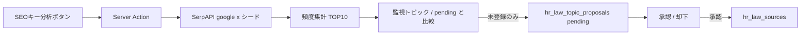

# SEOキー分析 → トピック候補設計

> 関連: `docs/superpowers/specs/2026-07-10-hr-law-topic-closed-loop-design.md`  
> 作成日: 2026-07-10  
> ステータス: ブレインストーミング承認済み（実装前仕様）

## 1. 背景・問題

監視トピック閉ループの第1版は入力シグナルを「チャット需要 + 厚労省新着」に限定し、SEO はスコープ外だった。  
SaaS 管理者が人事・労務領域の検索需要ギャップを手動で取り込みたいため、トピック候補タブからオンデマンドで SEO 近似キーワードを提案する導線が必要。

## 2. ゴール

1. 「トピック候補」画面から **SEOキー分析** を1クリックで実行できる
2. 人事関係者がアクセスしそうなキーワードの **TOP10（近似）** を SerpAPI で取得する
3. 既存の有効監視トピックと突合し、**未登録のみ** を `hr_law_topic_proposals`（pending）へ追加する
4. 承認は人が行う（自動で `hr_law_sources` には入れない）

## 3. 確定した設計判断

| 項目           | 決定                                                                                                      |
| -------------- | --------------------------------------------------------------------------------------------------------- |
| キーワード取得 | **SerpAPI**（`SERPAPI_API_KEY`）                                                                          |
| 近似手法       | 固定シード語で Google 検索 → **`related_searches`（＋あれば related_questions）を集約**し出現頻度で TOP10 |
| 実行経路       | **Server Action**（SaaS管理者のみ、`createAdminClient` で INSERT）                                        |
| 候補化         | 未登録のみ `pending` 追加。`source = 'seo'`                                                               |
| 承認           | 既存の承認／却下 UI をそのまま利用                                                                        |
| 非スコープ     | 真の全国 SEO 順位・Google Keyword Planner・週次自動実行・プレビュー確認ステップ                           |

## 4. 全体フロー



## 5. UI

配置: `LawTopicProposalList` の説明文行

- 左: 「チャット需要・厚労省新着から自動提案されます。…」（文言は SEO 手動分析がある旨を短く追記してよい）
- 右: **SEOキー分析** ボタン（ブランドオレンジ、`text-xs`、AWS 風シャープ）

実行中:

- ボタン `disabled`
- スピナーまたはドット + 「分析中…」
- 完了後メッセージ例: `SEO TOP10 を取得: 10件 / 候補追加: N件 / スキップ: M件`
- `revalidatePath` で一覧を更新

## 6. Server Action

`analyzeSeoKeywordsForTopicProposals()`（仮名）を `src/features/saas-law-knowledge/actions.ts` に追加。

### 6.1 権限

既存 `getSaasAdminUser()` と同じ（`appRole === 'developer'` またはレガシー `supaUser`）。

### 6.2 SerpAPI

- Endpoint: `https://serpapi.com/search.json`
- `engine=google`, `hl=ja`, `gl=jp`, `api_key=SERPAPI_API_KEY`
- シード（固定・第1版）:
  1. `人事`
  2. `労務`
  3. `労働基準法`
  4. `働き方改革`
  5. `社会保険`
- 各レスポンスから:
  - `related_searches[].query`（必須）
  - `related_questions[].question`（あれば。句読点除去してキーワード化）
- シード語そのものは TOP10 候補から除外（関連語のみ）
- キー未設定時: `{ ok: false, error: 'SERPAPI_API_KEY が未設定です' }`
- 個別シード失敗: ログして他シードは継続。全失敗ならエラー返却

### 6.3 TOP10 決定

1. `normalizeTopicKey`（既存と同一: 小文字化・空白除去）で正規化
2. 表示用 `topic` は最初に出現した表記を採用
3. 出現回数降順、同点は `topic` 文字列昇順
4. 上位 10 件を採用。`score` = 出現回数（最大でもシード数程度）

### 6.4 比較・INSERT

スキップ条件（いずれか該当でスキップ）:

- 有効監視トピック（`hr_law_sources.enabled = true`）の `topic_key` と一致
- 既に `status = 'pending'` の候補の `topic_key` と一致

INSERT 内容:

| 列             | 値                                         |
| -------------- | ------------------------------------------ |
| `topic`        | キーワード表記                             |
| `topic_key`    | 正規化キー                                 |
| `search_query` | キーワードと同じ（第1版）                  |
| `source`       | `'seo'`                                    |
| `score`        | 出現回数                                   |
| `status`       | `'pending'`                                |
| `evidence`     | `{ seeds, rank, hit_count, collected_at }` |

既存 pending への score 更新は行わない（未登録のみ追加。既 pending はスキップ件数に含める）。

## 7. データモデル変更

マイグレーション（`supabase migration new` → `migration up`。**`db reset` しない**）:

```sql
ALTER TABLE public.hr_law_topic_proposals
  DROP CONSTRAINT IF EXISTS hr_law_topic_proposals_source_check;

ALTER TABLE public.hr_law_topic_proposals
  ADD CONSTRAINT hr_law_topic_proposals_source_check
  CHECK (source IN ('chat', 'mhlw_discover', 'seo'));
```

型・UI:

- `HrLawTopicProposal['source']` に `'seo'` を追加
- `SOURCE_LABEL.seo = 'SEOキー分析'`

## 8. エラー・境界

| 状況               | 挙動                                 |
| ------------------ | ------------------------------------ |
| 権限なし           | エラーメッセージ                     |
| SerpAPI キーなし   | エラーメッセージ                     |
| SerpAPI 一部失敗   | 成功分で TOP10 を構成。0件ならエラー |
| TOP10 がすべて既存 | 追加 0・スキップ 10 を成功として表示 |
| DB INSERT 失敗     | エラーログ + 失敗メッセージ          |

## 9. テスト観点（手動）

1. ボタン押下でローディング表示 → 完了メッセージ
2. 未登録キーワードが pending に現れ、ラベルが「SEOキー分析」
3. 再実行で同一キーはスキップされ二重 pending にならない
4. 承認すると監視トピックに追加される（既存フロー）
5. `SERPAPI_API_KEY` 未設定時に分かりやすいエラー

## 10. 非スコープ（明示）

- 週次 cron への組み込み
- Keyword Planner / 検索ボリューム数値
- 候補追加前のプレビュー確認 UI
- シード語の管理画面編集（第1版はコード定数）
