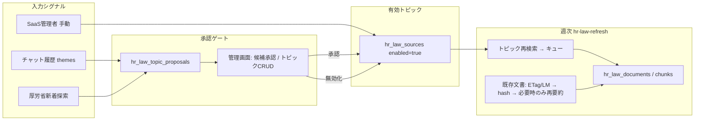

# 人事アップデート監視トピック閉ループ＋文書鮮度設計

> 関連: `docs/implementation-plan-ai-hr-assistant-evolution.md`  
> 作成日: 2026-07-10  
> ステータス: ブレインストーミング承認済み（実装前仕様）

## 1. 背景・問題

`/saas_adm/hr-law-knowledge` の監視トピック（`hr_law_sources`）は初期シード8件が中心で、チャット需要・厚労省の新テーマに応じた流動的改善が閉じていない。  
また収集済み文書は新規URL追加と失効RPCが中心で、既存ページの内容更新を継続的に反映する仕組みが弱い。

## 2. ゴール

1. **監視トピックの閉ループ**: シグナル → 候補 → SaaS管理者承認 → 有効トピック → 週次収集
2. **保持情報の最新化**: 既存文書を週次で鮮度チェックし、変化時のみ再要約・再埋め込み
3. **手動メンテ**: SaaS管理者がトピックを追加・論理削除（無効化）できる

## 3. 確定した設計判断

| 項目                | 決定                                                                                                      |
| ------------------- | --------------------------------------------------------------------------------------------------------- |
| トピック適用        | **提案＋SaaS管理者承認**（自動追加しない）                                                                |
| 提案ソース（第1版） | **チャット需要 + 厚労省新着探索**（SEOはスコープ外）                                                      |
| 手動操作            | トピックの**追加・削除（論理削除）・再有効化**                                                            |
| 削除の意味          | `enabled=false` + `disabled_at`。収集済み文書は残す                                                       |
| 鮮度判定            | **ハイブリッド**: Last-Modified/ETag → 変化時または欠落時に本文取得 → `content_hash` → 変化時のみ AI 更新 |
| アーキテクチャ      | **既存ジョブ拡張**（`hr-law-refresh` / `hr-assistant-template-mining`）。新規 cron ジョブは増やさない     |

## 4. 全体アーキテクチャ

## 5. データモデル

### 5.1 新規 `hr_law_topic_proposals`

| 列                  | 型                            | 説明                                              |
| ------------------- | ----------------------------- | ------------------------------------------------- |
| `id`                | uuid PK                       |                                                   |
| `topic`             | text NOT NULL                 | 提案トピック名                                    |
| `topic_key`         | text NOT NULL                 | 正規化キー（重複防止用。例: 小文字・空白除去）    |
| `search_query`      | text NOT NULL                 | 提案検索クエリ                                    |
| `source`            | text NOT NULL                 | `chat` / `mhlw_discover`                          |
| `evidence`          | jsonb NOT NULL DEFAULT '{}'   | 質問例・ヒットURL・件数など                       |
| `score`             | int NOT NULL DEFAULT 0        | 優先度（チャット出現回数等）                      |
| `status`            | text NOT NULL                 | `pending` / `approved` / `rejected` / `dismissed` |
| `reviewed_by`       | uuid NULL                     | 承認/却下した auth user                           |
| `reviewed_at`       | timestamptz NULL              |                                                   |
| `created_source_id` | uuid NULL FK → hr_law_sources | 承認時に作成/再有効化したソース                   |
| `created_at`        | timestamptz                   |                                                   |
| `updated_at`        | timestamptz                   |                                                   |

制約:

- pending 重複防止のため `topic_key` を upsert キーにする（同一キーの pending は score/evidence を更新）
- 承認済みキーへの再提案は、有効ソースが無ければ pending を再作成可

RLS:

- SELECT / UPDATE: SaaS管理者（既存の developer 判定に合わせる）
- INSERT: `service_role`（Edge Function）のみ。エンドユーザー向け actions からは書かない

### 5.2 拡張 `hr_law_sources`

| 追加列        | 説明                               |
| ------------- | ---------------------------------- |
| `updated_at`  | 更新日時                           |
| `disabled_at` | 論理削除時刻（`enabled=false` 時） |
| `origin`      | `seed` / `manual` / `proposal`     |

削除UI = `enabled=false`, `disabled_at=now()`。行は物理削除しない。

### 5.3 拡張 `hr_law_documents`

| 追加列               | 説明                                  |
| -------------------- | ------------------------------------- |
| `http_etag`          | 前回 ETag                             |
| `http_last_modified` | 前回 Last-Modified（text で生値保存） |
| `content_checked_at` | 最後に鮮度チェックした時刻            |

`content_hash` は継続利用。内容更新時は **同一 document id を UPDATE** し、チャンクは削除→再INSERT。

### 5.4 ログ拡張 `hr_law_refresh_logs`

| 追加列              | 説明                            |
| ------------------- | ------------------------------- |
| `freshness_checked` | 鮮度チェック件数                |
| `documents_updated` | 本文変化により再要約した件数    |
| `proposals_created` | 本実行で作った/更新した候補件数 |

## 6. 処理フロー

### 6.1 週次 `hr-law-refresh`（拡張順）

1. 実施ログ開始
2. `expire_hr_law_documents()`（既存）
3. **鮮度チェック**（新規）
   - 対象: `status='published'`、上限 30件/回、`content_checked_at` ASC NULLS FIRST
   - `HEAD`（失敗時は GET）で ETag / Last-Modified
   - 前回と同一 → `content_checked_at` のみ更新（スキップ）
   - 変化 or ヘッダ無し → 本文取得 → `content_hash` 比較
   - hash 同一 → チェック時刻・可能なら ETag/LM 更新
   - hash 変化 → summarize → document UPDATE → chunks 差し替え
4. **有効トピック再検索**（既存）→ `hr_law_crawl_queue`
5. **キュー消化**（既存）→ 新規登録
6. **厚労省新着提案**（新規・軽量）
   - OpenRouter `web_search` + allowed_domains
   - クエリ例: `労働 改正 通達 ガイドライン`（domains に任せ site: は付けない）
   - 既存有効トピックと `topic_key` 類似のものは除外
   - `hr_law_topic_proposals` に `source=mhlw_discover`, `status=pending` upsert
7. ログ更新（freshness / updated / proposals 含む）

上限（1実行あたりの目安）:

- 鮮度チェック: 30件
- トピック検索: 最大10（既存）
- キュー消化: 最大15（既存）
- 新着提案の検索ヒット: 最大5 → 候補化は最大3

### 6.2 週次 `hr-assistant-template-mining`（拡張）

- 既存: mined テンプレ生成
- 追加: 集約した `themes` を `hr_law_topic_proposals` に `source=chat` で upsert
  - `score` = テナント横断の出現回数
  - `evidence` = 代表質問テキスト（個人情報・固有名詞は既存プロンプトで除去済み前提）
  - 既存有効トピックと正規化一致するものは提案しない
- 「sources を自動上書きしない」は維持。proposals への書き込みは行う

### 6.3 SaaS管理画面 `/saas_adm/hr-law-knowledge`

タブ:

1. **監視トピック** — 一覧・手動実行・追加・無効化・再有効化
2. **トピック候補** — pending 一覧・承認・却下
3. **収集済み文書**
4. **ログ**

承認時:

- 同名（`topic_key`）の `hr_law_sources` が無効で存在 → `enabled=true`, `disabled_at=null` で再有効化
- 存在しない → INSERT（`origin=proposal`）
- proposal → `approved`, `created_source_id` 設定

却下時: `status=rejected`

手動追加: `origin=manual`, `enabled=true`  
手動削除: 論理削除のみ

## 7. エラー処理

| 状況                           | 振る舞い                                             |
| ------------------------------ | ---------------------------------------------------- |
| HEAD / fetch 失敗              | そのURLスキップ、errors に記録。次回またチェック対象 |
| 要約・埋め込み失敗             | **旧文書を残す**（空更新しない）。エラーログ         |
| 提案 upsert 失敗               | ジョブ継続、errors に記録                            |
| 承認時に有効な同名トピックあり | エラー表示（重複作成しない）                         |
| OpenRouter 未設定              | ジョブ失敗をログ（既存どおり）                       |

## 8. 成功指標

- 週次で pending 候補が増え、管理者が承認/却下できる
- 承認トピックが翌週以降の収集対象になる
- ログで「ヘッダ同一スキップ / hash同一スキップ / 実更新」を区別できる
- 無効化トピックが週次検索から外れる（文書は残る）

## 9. スコープ外（第1版）

- SEOキーワード自動取込
- トピックの完全自動追加（承認なし）
- トピック物理削除、および無効化に連動した文書一括削除
- 新規独立 cron ジョブの追加

## 10. 主要変更ファイル（実装時の目安）

- `supabase/migrations/` — proposals / sources / documents / logs 拡張
- `supabase/functions/hr-law-refresh/` — 鮮度・新着提案
- `supabase/functions/hr-assistant-template-mining/` — themes → proposals
- `src/features/saas-law-knowledge/` — actions / queries / UI（CRUD・候補タブ）
- `docs/implementation-plan-ai-hr-assistant-evolution.md` — 本閉ループを追記

## 11. テスト観点

- 提案 upsert の重複（同一 topic_key）
- 承認 → sources 作成 / 再有効化
- 論理削除後に refresh が当該トピックを拾わない
- 鮮度: ETag同一で AI 呼ばない（モック）
- 鮮度: hash変化で chunks 差し替え、旧 id 維持
- 要約失敗時に旧 summary/detail が残る
