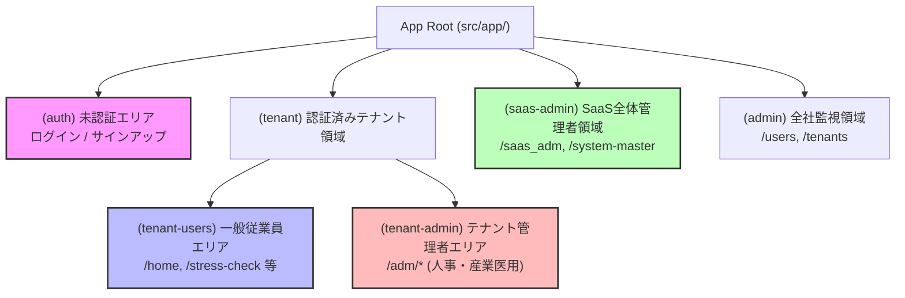
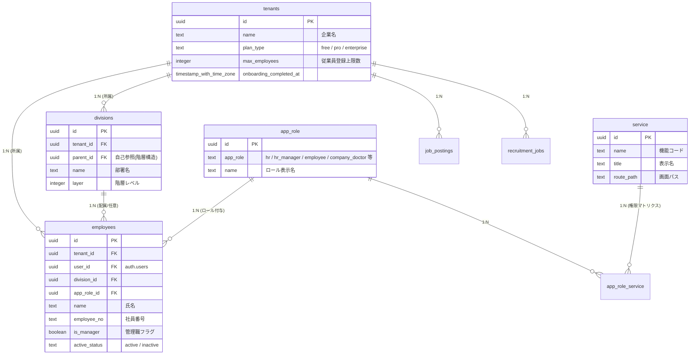
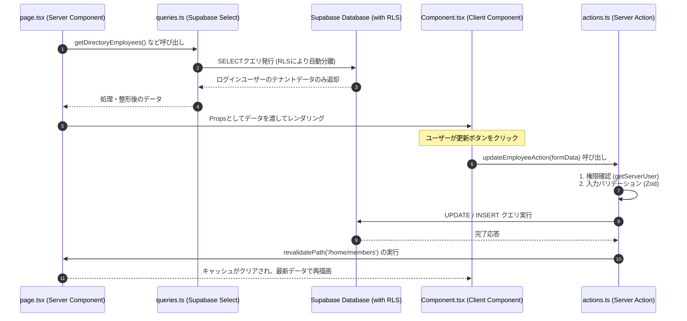
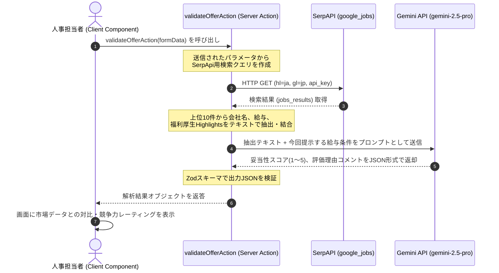

# HR-DX SaaS システム設計書

本書は、Next.js 16 (App Router) および Supabase を基盤とするマルチテナント型SaaSシステム「HR-DX」のシステム設計書（開発者向けドキュメント）です。新規参画する開発者が迷わず実装・拡張に入り、コードの規約を遵守できるよう、システム全体の構造やデータフロー、外部連携の仕組みを詳細に解説します。

---

## 1. システム概要 & アーキテクチャ

### 1.1 ルートグループによる権限・レイアウト分離

Next.js の App Router の機能である「ルートグループ（括弧付きフォルダ）」を活用し、URLパスを変更することなく、異なる権限ロールに応じたレイアウトの適用およびセキュリティガードを実装しています。

| ルートグループ       | 役割と対象パス                                                                          | 適用されるレイアウト                                                | 権限制御・ガードの具体的な仕組み                                                                                                                       |
| :------------------- | :-------------------------------------------------------------------------------------- | :------------------------------------------------------------------ | :----------------------------------------------------------------------------------------------------------------------------------------------------- |
| **`(auth)`**         | 認証前のユーザー用パス。<br>`/login`, `/signup`, `/reset-password` など。               | `ShaderWaveCanvas`（WebGL波形背景）を含むスプリット画面レイアウト。 | `middleware.ts` にて認証済みユーザーのアクセスを制限し、ポータルへリダイレクトします。                                                                 |
| **`(tenant-users)`** | マルチテナント内の一般従業員用ポータル画面。<br>`/home`, `/top`, `/stress-check` など。 | `AppLayout (variant="portal")`<br>サイドバー・ヘッダー付ポータル。  | 一般従業員がアクセス可能な標準のポータル領域。                                                                                                         |
| **`(tenant-admin)`** | 各企業の人事・管理者向け管理画面。<br>`/adm/*` 以下のパス。                             | `AppLayout (variant="admin")`<br>管理者用のサイドバーとカラー。     | `(tenant-admin)/layout.tsx` にて `getServerUser()` を参照し、`user.appRole === 'employee'`（一般従業員）の場合は自動的にポータルへリダイレクトします。 |
| **`(saas-admin)`**   | SaaSシステム全体の管理画面。<br>`/saas_adm`, `/system-master` など。                    | `AppLayout (variant="saas")`<br>SaaS管理用画面。                    | `(saas-admin)/layout.tsx` にて、`user.role === 'supaUser'` または `user.appRole === 'developer'` 以外のアクセスを厳格に遮断します。                    |

#### 【Mermaid図】システム全体のルーティング・権限分離の階層構造図



---

### 1.2 Edge Middleware (`middleware.ts`) によるセッション・ログ管理

Edge Runtime 上で動作する `src/middleware.ts` は、すべての有効なリクエストに対して以下の処理を同期的に実行します。

1. **セッション更新と認証取得**:
   `@supabase/ssr` の `createServerClient` を呼び出す `updateSession` を実行し、Cookie内の認証セッションをリフレッシュし、ユーザーを取得します。
2. **アクセスログ (PAGE_VIEW) の記録**:
   - **記録条件**: リクエストメソッドが `GET` であり、静的ファイルや Next.js 内部通信（`_next` 等）ではない「ページアクセス」のみを対象とします。
   - **非同期の補完ロジック**: `user_metadata` に `tenant_id` が含まれていない場合、Edge 上で `employees` テーブルから `user_id` が一致する行をセレクトして `tenant_id` を取得し、それを `access_logs` にインサートします。
   - **安全性担保**: ログのインサート中に Edge Runtime が処理を打ち切らないよう、`await insertLog()` でインサート処理の完了を同期的に待機します。
3. **API保護**:
   未認証ユーザーが `/api/` 以下のエンドポイント（`/api/auth` を除く）にリクエストを送った場合、ログイン画面へのリダイレクトではなく、JSON形式で `{ ok: false, error: 'ログインが必要です' }` を `status: 401` で返します。

---

### 1.3 RLS (行レベルセキュリティ) によるマルチテナント分離

他社のデータ漏洩を防ぐため、Supabase（PostgreSQL）層で RLS を徹底しています。基本クライアントから実行するすべての SQL クエリには RLS ポリシーが自動適用されます。

#### マルチテナント用のカスタム定義関数

- **`current_tenant_id()`**: `auth.uid()`（ログイン中の Auth ユーザーID）をキーに、`employees` テーブルから所属テナントの ID を返却する `SECURITY DEFINER` 関数。
- **`current_employee_app_role()`**: ログインユーザーの `employees.app_role_id` に紐づく `app_role` 名を返す。

#### RLSポリシーのパターン

- **テナント分離ポリシー**:
  ```sql
  CREATE POLICY "employees_select_same_tenant" ON "public"."employees"
    FOR SELECT USING (("tenant_id" = "public"."current_tenant_id"()));
  ```
  このように、すべてのテナント用テーブルにおいて、レコードの `tenant_id` と `current_tenant_id()` の一致を検証します。
- **ロールベースの追加制御（例: ストレスチェック面接指導記録）**:
  ```sql
  CREATE POLICY "sc_interviews_select_doctor" ON "public"."stress_check_interviews"
    FOR SELECT USING (
      ("tenant_id" = "public"."current_tenant_id"()) AND
      ("public"."current_employee_app_role"() = ANY (ARRAY['company_doctor'::text, 'company_nurse'::text]))
    );
  ```
  テナント隔離に加え、ログインユーザーのロールが「産業医」「産業看護師」である場合にのみアクセスを許可します。

---

## 2. データモデル & データベース設計

### 2.1 主要テーブル構造とリレーション

初期スキーマ (`init_schema.sql`) から読み取れる、主要エンティティの関係は以下の通りです。

#### 【Mermaid図】主要エンティティの関係性（ER図）



#### 主要テーブルの制約・トリガー

1. **登録数上限制限 (`trg_check_max_employees`)**:
   `employees` テーブルへの INSERT 前にトリガー関数 `check_max_employees()` が走り、`tenants` に設定されている `max_employees` を現在登録数が超えていないかを検証します。超過時は例外エラーによりインサートが防がれます。
2. **自動 `updated_at` 更新 (`set_updated_at`)**:
   `job_postings` や `stress_check_interviews` 等の更新時、自動で `updated_at` に `now()` が挿入されます。

---

### 2.2 3つのユーザー種別と権限マトリクス

1. **SaaS管理者 (SaaS Administrator)**:
   - **識別**: `auth.users` の `user_metadata->role` が `'supaUser'`、もしくは `employees` の結合ロールが `'developer'`。
   - **権限**: ルートグループ `(saas-admin)` 以下の機能（システムマスター、全体のアクセスログ閲覧、全テナントの一覧など）が利用可能。
2. **テナント管理者 (Tenant Administrator)**:
   - **識別**: `employees.app_role_id` に紐づく `app_role` が `'hr'` (人事管理者) や `'hr_manager'`。
   - **権限**: 自テナント内のデータ（従業員登録、部署作成、各種ダッシュボード閲覧など）の追加・更新、および `/adm` 以下の管理者メニューへのアクセス。
3. **一般従業員 (General Employee)**:
   - **識別**: `employees.app_role_id` に紐づく `app_role` が `'employee'`。
   - **権限**: 一般ポータル画面 (`/home`, `/top`) および自身の受検・申請メニューのみ利用可能。

---

## 3. データアクセスパターン & 共通規約

### 3.1 `queries.ts` と `actions.ts` の役割分担

当システムでは、サーバーサイド（RSC）とクライアントサイドのデータ授受において、読み込みを `queries.ts`、書き込みを `actions.ts` (Server Actions) に一貫して分離する設計規約を採用しています。

- **`queries.ts` (参照系)**:
  `page.tsx` などの React Server Component から直接インポートして呼び出し、DBからデータを取得します。RLSが自動的に効く `createClient()` を利用するため、明示的なテナントの絞り込み SQL を書かなくてもテナント分離が保証されます。
- **`actions.ts` (書き込み系)**:
  Client Component 内のイベントから呼び出されます。ファイル上部に `'use server'` を宣言し、データのバリデーション、DBの更新を行います。更新後は `revalidatePath()` により、Next.js サーバーに対してデータが変更されたパスの再検証（画面リフレッシュ）を要求します。

#### 【Mermaid図】「Page(Server) -> Query -> Client -> Action」にいたる標準的なデータフロー図



---

### 3.2 Zod を用いたバリデーション規約

- **配置規約**: 各機能ディレクトリ内の `schemas.ts` （例: `src/features/signup/schemas.ts`）に定義します。
- **スキーマ定義**: 入力の必須チェックや型のチェックを Zod オブジェクトで定義し、エラーメッセージには日本語の明示的なテキストを指定します。
- **検証実行**:
  Server Action 側で、引数として受け取ったデータ（`FormData` またはオブジェクト）を `schema.safeParse(data)` で検証し、失敗時は検証エラーメッセージを `{ success: false, error: ... }` の形式でフロントエンドに返します。

---

### 3.3 `date-fns` と日本標準時（Asia/Tokyo）運用のルール

本システムは `Asia/Tokyo` タイムゾーンで一貫して運用されています。時間計算や表示用の共通処理は `src/lib/datetime.ts` に実装されています。

1. **タイムスタンプ付き日時の書き込み**:
   現在日時を DB に保存する際は、**`toJSTISOString()`** ユーティリティを使用し、`+09:00` のオフセットが付与された ISO 8601 文字列（例: `2026-03-07T12:00:00.000+09:00`）を作成して `timestamptz` 型フィールドに挿入します。
2. **暦日の書き込み**:
   日付のみ（`date` 型）に保存する入社年月日等は、**`toJSTDateString()`** で `YYYY-MM-DD` 形式の日付文字列を生成して保存します。
3. **日付・時刻の表示**:
   DBから読み取った日時（UTCなど）を画面で表示する際は、**`formatDateInJST(iso)`** を用いて JST の `YYYY/MM/DD` に変換するか、**`formatDateTimeInJST(iso)`** を介して日本時間に補正した上で画面にレンダリングします。

---

## 4. 各画面・機能および外部API詳細仕様

### 4.1 AI 採用支援機能（Gemini API 連携）の実行ロジック

本システムでは、従来の OpenAI SDK から **Google Gemini API** への移行が完了しており、`src/lib/ai/gemini.ts` で一元管理されています。

#### 実行上の制約

- **サーバーサイド実行の義務**: `GEMINI_API_KEY` の安全性を担保するため、Gemini クライアントの初期化および API 呼び出し処理は、すべて **Server Actions 内部** で実行され、クライアントサイドからは隠蔽されます。
- **利用制限**: `tryConsumeAiUsage()` を用いて、SaaS契約プランに基づいた月次利用回数の制限チェックと使用実績ログ (`ai_usage_logs`) の挿入をアトミックに検証します。

#### 生成ロジック

1. ユーザーから入力された求人背景を基に、`gemini-2.5-pro` (`GEMINI_PRO_MODEL`) を用いてコンテンツを生成。
2. `SYSTEM_PROMPT` において、日本のビジネス慣習・男女雇用機会均等法等の遵守を指示。
3. **推論判定ロジック (Chain of Thought)**: 求める職種や年収層から「有料スカウト媒体が適しているか」または「無料のIndeed / ハローワークで充分か」を AI に判定させ、出力フォーマットをパターンA / Bに分岐させます。
4. `responseMimeType: 'application/json'` による JSON 生成を強制し、正規化した上で `recruitment_jobs` テーブルに下書き保存します。

---

### 4.2 SerpAPI（求人検索）の統合方法とデータ反映フロー

オファーの競争力検証（`offer-validation`）や求人相場の可視化において、リアルタイムの求人マーケット情報を SerpAPI から取得します。

- **検索エンジン**: `google_jobs` エンジンを利用。
- **パラメータ設定**:
  - `q`: ユーザーが入力した職種条件、勤務地などを組み合わせた検索クエリ（例: `"${jobConditions} ${location} 求人 年収"`）
  - `hl`: `'ja'` (日本語環境の優先表示)
  - `gl`: `'jp'` (日本国内の検索)
- **タイムアウト**: 通信遅延による関数ブロックを防ぐため、`AbortSignal.timeout(30_000)`（30秒）によるタイムアウト処理を実行します。

#### 【Mermaid図】AI機能および求人検索機能呼び出し時のシーケンス図



---

## 5. 開発・運用環境

### 5.1 `allowedOrigins` の設定意図

`next.config.ts` において、`experimental.serverActions.allowedOrigins` を以下のように指定しています。

```typescript
serverActions: {
  bodySizeLimit: '50mb',
  allowedOrigins: [
    'https://app.hr-dx.jp',
    ...(vercelOrigin ? [vercelOrigin] : []),
    'http://localhost:3000',
    'http://127.0.0.1:3000',
  ],
}
```

#### 設定の背景と意図

Next.js は CSRF 攻撃から Server Actions を保護するため、Host ヘッダーとリクエストの `Origin` ヘッダーが一致しているかを検証します。
Vercel などのホスティング環境でリバースプロキシ経由で接続される場合や、プレビューブランチで一時ドメイン（`*.vercel.app`）が割り当てられた場合、この検証が誤検知されて `Invalid post request` エラーが発生することがあります。
これを回避するため、本番用のカスタムドメイン（`https://app.hr-dx.jp`）、Vercel から動的に提供されるホストドメイン（`process.env.VERCEL_URL`）、およびローカル開発用（`localhost:3000` / `127.0.0.1:3000`）を明示的にホワイトリストに登録しています。

---

### 5.2 Vercel 自動デプロイと再ビルド発火の仕組み

- **自動デプロイ**:
  GitHub リポジトリの対象ブランチ（例: `main`）にコミットがプッシュされたタイミングで、Vercel がそれを検知し自動的にビルド＆デプロイを実行します。
- **再ビルドの強制発火 (`trigger-vercel-build.txt`)**:
  Vercel の Git 連携において、環境変数の変更適用や、ビルドの失敗から再検証をかけたいとき、コードに変更がないと自動ビルドが走りません。
  そのため、ルート直下に `trigger-vercel-build.txt` というダミーのテキストファイルを配置しています。このファイル内のタイムスタンプを書き換えてコミット・プッシュすることにより、コードを変更することなく Vercel のデプロイを能動的に発火させることができます。

---

## 6. 要確認事項・推測される仕様（開発者向け）

ソースコード上から読み取れる、実装時あるいは運用の際の注意ポイントです。

1. **Stripeの Webhook 連携**:
   新規サインアップ処理で Stripe を呼び出して決済情報を登録していますが、Stripe 側での実際の支払い処理成功（銀行振込完了やカード決済承認）を非同期で検知してテナントのステータスを更新する Webhook ハンドラ (`src/app/api/webhooks/stripe`) の挙動・接続テスト状況を事前に確認してください。
2. **多言語対応の多重度**:
   本システムは多言語対応（日本語・英語）を想定していますが、現行ソース内では多くの検証用エラーテキストや AI からの返却フォーマット（Geminiプロンプトの記述等）が日本語固定で記述されています。英語環境下でのエラーハンドリングや翻訳リソースの定義方針について設計調整が必要です。
3. **サーバー関数のタイムアウト**:
   `next.config.ts` で Server Actions の `bodySizeLimit` を `50mb` に引き上げていますが、Vercel の Hobby プラン等では Serverless Function の実行時間制限が 10秒〜15秒程度になっています。大容量の PDF 履歴書や資料アップロード時に AI 生成やパースが重なるとタイムアウトエラーになる懸念があるため、本番環境のプラン構成と照らし合わせる必要があります。
